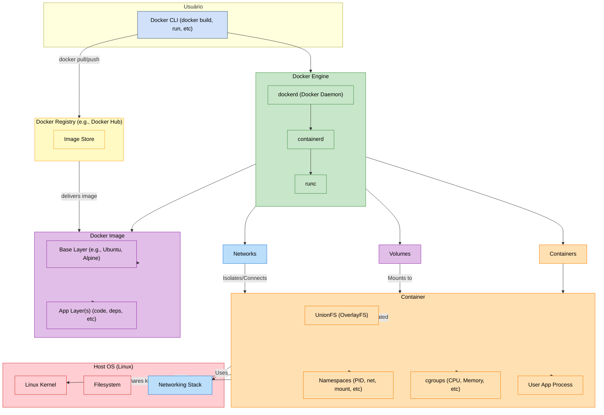

# Funcionamento do Docker

Docker é uma plataforma de contêineres que permite criar, gerenciar e executar aplicações de forma isolada e portátil. O diagrama abaixo ilustra a arquitetura do Docker e seus principais componentes. Abaixo, explicamos cada um deles:

---

## Diagrama da Arquitetura do Docker

---

## Componentes da Arquitetura do Docker

### 1. Usuário
- **Docker CLI**: A interface de linha de comando do Docker (ex.: `docker build`, `docker run`, etc.) é usada para interagir com o Docker Engine. Ela permite que os usuários enviem comandos para construir, executar e gerenciar contêineres.

### 2. Docker Engine
O Docker Engine é o núcleo do Docker e é composto por três componentes principais:
- **Docker Daemon (`dockerd`)**: O processo principal que gerencia os contêineres, imagens, volumes e redes. Ele escuta as solicitações da CLI e interage com os outros componentes.
- **Containerd**: Um daemon que gerencia o ciclo de vida dos contêineres, incluindo execução, pausa e exclusão.
- **Runc**: Uma implementação de runtime de contêiner que segue o padrão OCI (Open Container Initiative). Ele é responsável por criar e executar os contêineres.

### 3. Imagens
- **Base Layer**: A camada base de uma imagem, geralmente contendo um sistema operacional mínimo (ex.: Ubuntu, Alpine).
- **App Layers**: Camadas adicionais que incluem o código da aplicação, dependências e configurações. As imagens são compostas por múltiplas camadas empilhadas.

### 4. Contêineres
Os contêineres são instâncias de imagens em execução. Eles compartilham o kernel do sistema operacional do host e são isolados por meio de:
- **UnionFS (OverlayFS)**: Um sistema de arquivos que combina várias camadas em uma única visão.
- **Namespaces**: Fornecem isolamento para recursos como PID, rede, sistema de arquivos, etc.
- **Cgroups**: Controlam o uso de recursos como CPU e memória.
- **User App Process**: O processo principal da aplicação em execução dentro do contêiner.

### 5. Registro de Imagens
- **Docker Registry**: Um repositório para armazenar e distribuir imagens Docker. O Docker Hub é o registro público mais popular.
- **Image Store**: O local onde as imagens são armazenadas no registro.

### 6. Host OS
O Docker é executado no sistema operacional do host e utiliza:
- **Kernel**: O kernel do Linux é compartilhado entre os contêineres.
- **Filesystem**: O sistema de arquivos do host é usado para armazenar dados persistentes.
- **Networking Stack**: Gerencia a conectividade de rede dos contêineres.

### 7. Volumes e Redes
- **Volumes**: Fornecem armazenamento persistente para os contêineres, permitindo que dados sejam mantidos mesmo após a exclusão do contêiner.
- **Redes**: Conectam e isolam os contêineres, permitindo comunicação entre eles ou com o mundo externo.

---

## Fluxo de Trabalho do Docker

1. O usuário interage com o Docker CLI para executar comandos.
2. O Docker CLI comunica-se com o Docker Engine.
3. O Docker Engine gerencia imagens, contêineres, volumes e redes.
4. Imagens podem ser puxadas ou enviadas para um registro (ex.: Docker Hub).
5. Contêineres são criados a partir de imagens e executados no host.

---

Este guia, junto com o diagrama, fornece uma visão geral clara da arquitetura do Docker e como seus componentes interagem para fornecer uma plataforma eficiente para contêineres.