# 📄 Gerenciamento de Logs no Docker

Este documento aborda as práticas recomendadas para o gerenciamento de logs em ambientes Docker, incluindo comandos úteis, drivers de log, rotação e estratégias de centralização.​:contentReference[oaicite:2]{index=2}

---

## 🧠 Conceitos Fundamentais

- **STDOUT/STDERR**: :contentReference[oaicite:3]{index=3}
- **Logging Driver**: :contentReference[oaicite:4]{index=4}
- **Log Rotation**: :contentReference[oaicite:5]{index=5}
- **Centralização de Logs**: :contentReference[oaicite:6]{index=6}​:contentReference[oaicite:7]{index=7}

---

## 🛠️ Comandos Úteis

Visualizar logs de um container:

```bash
docker logs meu-container
```
:contentReference[oaicite:8]{index=8}

Seguir logs em tempo real:

```bash
docker logs -f meu-container
```
:contentReference[oaicite:9]{index=9}

Exibir os últimos 100 registros:

```bash
docker logs --tail 100 meu-container
```
:contentReference[oaicite:10]{index=10}

Filtrar logs por palavra-chave:

```bash
docker logs meu-container | grep "erro"
```
:contentReference[oaicite:11]{index=11}

---

## ⚙️ Configuração de Logging Drivers

:contentReference[oaicite:12]{index=12}​:contentReference[oaicite:13]{index=13}

Verificar o driver de log padrão:

```bash
docker info --format '{{.LoggingDriver}}'
```
:contentReference[oaicite:14]{index=14}

Verificar o driver de log de um container específico:

```bash
docker inspect -f '{{.HostConfig.LogConfig.Type}}' meu-container
```
:contentReference[oaicite:15]{index=15}

### 📦 Exemplos de Drivers

- **json-file**: :contentReference[oaicite:16]{index=16}
- **local**: :contentReference[oaicite:17]{index=17}
- **syslog**: :contentReference[oaicite:18]{index=18}
- **journald**: :contentReference[oaicite:19]{index=19}
- **fluentd**, **gelf**, **awslogs**, entre outros.​:contentReference[oaicite:20]{index=20}

---

## 🔄 Rotação de Logs

:contentReference[oaicite:21]{index=21}​:contentReference[oaicite:22]{index=22}

```json
{
  "log-driver": "json-file",
  "log-opts": {
    "max-size": "10m",
    "max-file": "3"
  }
}
```
:contentReference[oaicite:23]{index=23}

:contentReference[oaicite:24]{index=24}​:contentReference[oaicite:25]{index=25}

---

## 🌐 Centralização de Logs

:contentReference[oaicite:26]{index=26}​:contentReference[oaicite:27]{index=27}

- **ELK Stack (Elasticsearch, Logstash, Kibana)**
- **Fluentd**
- **Graylog**
- **Splunk**
- **Loggly**

:contentReference[oaicite:28]{index=28}​:contentReference[oaicite:29]{index=29}

---

## 📊 Diagrama de Fluxo de Logs

```mermaid
flowchart TD
    A[Aplicação no Container] --> B[STDOUT/STDERR]
    B --> C[Logging Driver]
    C --> D{Destino}
    D -->|json-file| E[Arquivo no Host]
    D -->|syslog| F[Syslog do Sistema]
    D -->|fluentd| G[Agente Fluentd]
    D -->|awslogs| H[AWS CloudWatch]
```


:contentReference[oaicite:30]{index=30}

---

:contentReference[oaicite:31]{index=31}​:contentReference[oaicite:32]{index=32}
