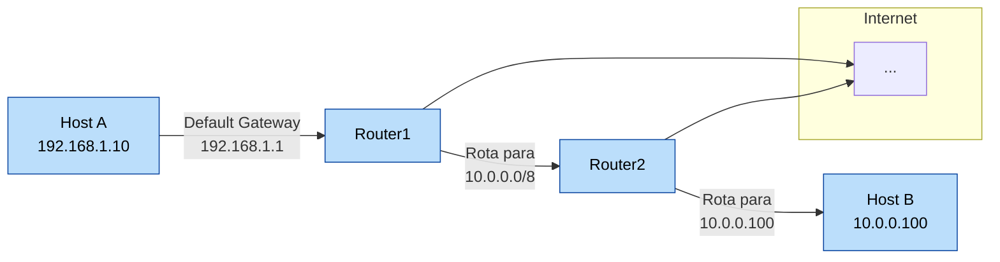

# 🚦 Fundamentos de Roteamento (Routing)

O **roteamento** é o processo de selecionar caminhos em uma rede para enviar pacotes de dados de uma origem até um destino. Ele ocorre principalmente na **Camada 3 (Rede)** do modelo OSI e é essencial para a comunicação entre redes distintas.

---

## 🧠 Conceitos Fundamentais

- **Roteador**: Dispositivo que encaminha pacotes entre redes com base em tabelas de roteamento.
- **Tabela de Roteamento**: Conjunto de regras que mapeiam destinos para próximos saltos.
- **Gateway Padrão**: Caminho usado quando não há rota específica para um destino.
- **Next Hop**: Próximo endereço IP para o qual o pacote deve ser encaminhado.

---

## 🗺️ Tipos de Roteamento

### 📌 Estático

- Rotas configuradas manualmente.
- Simples, previsível, mas pouco flexível.
- Ideal para redes pequenas ou estáticas.

**Exemplo:**
```bash
ip route add 192.168.2.0/24 via 192.168.1.1
```

---

### 🔄 Dinâmico

- Usa protocolos para aprender rotas automaticamente.
- Adapta-se a falhas e mudanças na topologia.
- Mais complexo, mas escalável.

**Protocolos Comuns:**
- **RIP** (Routing Information Protocol)
- **OSPF** (Open Shortest Path First)
- **BGP** (Border Gateway Protocol) — usado na internet.

---

## 📦 Estrutura de uma Rota

Uma entrada típica de rota possui:

- **Destino**: Rede ou host.
- **Máscara**: Determina o tamanho do bloco de IP.
- **Gateway (next hop)**: Para onde enviar o pacote.
- **Interface**: Por qual adaptador enviar.

**Exemplo (Linux):**
```bash
default via 192.168.0.1 dev eth0
10.0.0.0/8 dev eth1 proto kernel scope link src 10.0.0.2
```

---

## 🔍 Comandos de Diagnóstico

### Linux

```bash
ip route          # ver tabela de rotas
traceroute 8.8.8.8
ping 192.168.1.1
```

### Windows

```cmd
route print
tracert 8.8.8.8
```

---

## 🧪 Boas Práticas

- Sempre valide as rotas com `traceroute` ou `ip route`.
- Use rotas estáticas para controle previsível e específico.
- Use protocolos dinâmicos em redes corporativas de médio/grande porte.
- Evite loops de roteamento com filtros e métricas corretas.

---

## 📊 Diagrama de Roteamento



---

Este conteúdo faz parte da [pasta de redes](../networks/) do repositório [`study`](../README.md).
